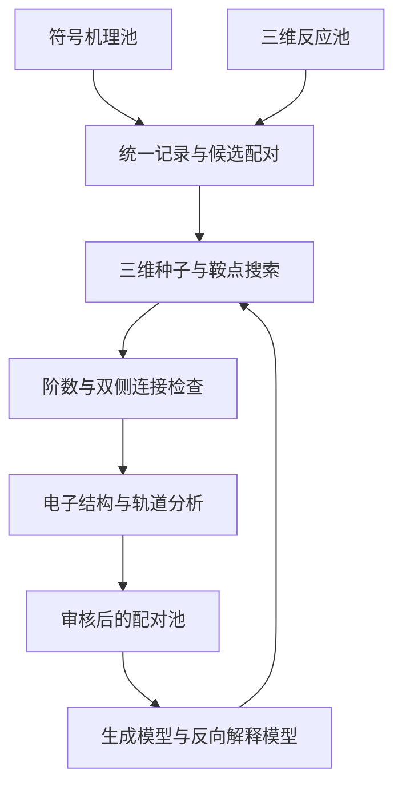

# 架构与验证状态

## 数据流

图中“审核后的配对池”和两个学习模型是研究目标，当前尚未完成；代码已经实现数据入口、记录、数值后端和电子结构特征。

## 一个事件的身份

`event_id` 保留源库和源事件索引；它不等于化学身份。化学图匹配以整套反应物与产物为单位，保留化学计量、同位素、形式电荷、自由基与立体信息，不去掉旁观离子或质子来制造重合。

`symbolic` 储存端点图、原始箭头及上游行。`physical` 储存原子序列、Å 坐标、明确单位的能量/力、方法和源文件位置。`system` 储存电荷、自旋多重度和环境；未知字段是 null，绝不默认中性或单重态。`provenance` 储存源 DOI、文件哈希、行号/HDF5 组。

## 独立的验证维度

| 维度 | 导入时 | 进一步证据 |
|---|---|---|
| 箭头 | source_annotation_unverified / not_available | 人工审核、轨道证据、等价表示集合 |
| 驻点 | not_checked | 明确 PES 上的残余力 |
| 鞍点阶数 | not_checked | 去除刚体模态后的负频数与阈值 |
| 连接性 | not_checked | 实际双侧路径与极小值身份，及所用理论 |
| 动力学 | not_checked | 指定温度、标准态、自由能、浓度及网络 |

`pair` 输出 `whole_system_graph_candidate`，`verified_pair=false`。它不是多模态监督真值，不能直接对其使用正配对对比学习损失。端点图一致仍需联合原子映射、三维顺序、条件及鞍点路径证据。

## 后端契约

ASE Calculator 提供能量 eV 与力 eV/Å，力必须为同一能量的负梯度。Hessian 来自该力的中心差分，单位 eV/Ų；分子振动分析做质量加权并投影平动/转动。当前只接受无约束非周期分子。

PySCF 仅实现气相闭壳层单重态。自定义 MLIP 必须负责自己的元素、电荷、自旋及适用域检查。模型权重版本应进入后端配置，重跑实验时保存权重 SHA256。

双侧 BFGS 只用于原型连接检查，不是严格 IRC；近似 PES 上的结论不得声称为实验机理。原型未自动完成端点图重建及同构匹配，也不把距离矩阵差异当作不同反应的证明。

## 学习阶段应增加的接口

后续可把生成模型实现为读取当前事件和条件、返回多条 `arrow_hypothesis + seed_xyz + model_provenance` 的独立服务；反向解释器读取 `verified_path + electronic_features` 返回多个带概率的箭头分组。二者均不得直接修改原始标签，反馈通过新记录或带版本的标注层写入。

保留独立于前向箭头假设的三维探索预算。搜索结果至少分成 `intended_valid_event`、`alternative_valid_event`、`unresolved`、`outside_domain`；其中只有前两类获得新的物理事件记录，后两类不能作为化学不可能的负标签。
