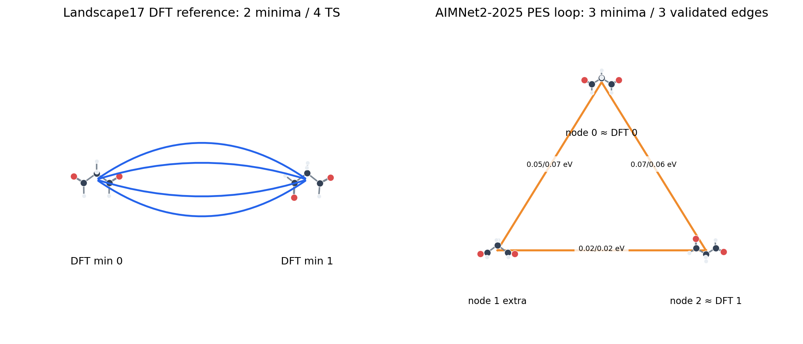

# AIMNet2-2025 复杂体系 TransitionNet 验证 v9

本轮采用严格根连通判据：只有双侧下降至少一端回到发起物理极小值，事件才进入网络。旧报告中的脱根边不会继续计作增长。

## Landscape17 malonaldehyde 完整 KTN 对照

- DFT 参考：2 个极小值、4 条 TS。
- 参考 TS 辅助上限：AIMNet2-2025 保留 2/4 条连接；未得到完整参考网络。
- 自主 PES loop：32 次二面角盆地搜索得到 3 个极小值；匹配参考 2/2，额外盆地 1 个。
- NEB→Sella→双侧下降得到 3 条严格模型边，其中精确匹配参考 TS 1/4。

## 自主搜索对照

| 体系 | 策略 | 状态 | 尝试 | 评估 | 节点 | 严格边 | 同键图边 | 脱根候选 |
|---|---|---|---:|---:|---:|---:|---:|---:|
| landscape17_malonaldehyde_min0 | arrows | completed | 36 | 34800 | 4 | 3 | 0 | 5 |
| landscape17_malonaldehyde_min0 | geometry | completed | 9 | 8330 | 1 | 0 | 0 | 1 |
| landscape17_malonaldehyde_min0 | hybrid | completed | 36 | 35547 | 3 | 2 | 0 | 3 |
| glyceraldehyde | arrows | completed | 30 | 29833 | 1 | 0 | 0 | 3 |
| glyceraldehyde | geometry | completed | 18 | 18547 | 2 | 1 | 0 | 3 |
| glyceraldehyde | hybrid | completed | 30 | 30473 | 2 | 1 | 0 | 4 |
| glycolaldehyde | arrows | completed | 9 | 8028 | 1 | 0 | 0 | 5 |
| glycolaldehyde | geometry | completed | 9 | 7985 | 1 | 0 | 0 | 1 |
| glycolaldehyde | hybrid | completed | 18 | 15899 | 1 | 0 | 0 | 6 |
| atlas_glycolaldehyde_hydration_o0 | arrows | completed | 24 | 22923 | 6 | 0 | 0 | 3 |
| atlas_glycolaldehyde_hydration_o0 | geometry | completed | 9 | 8610 | 1 | 0 | 0 | 0 |
| atlas_glycolaldehyde_hydration_o0 | hybrid | completed | 24 | 22879 | 5 | 0 | 0 | 2 |
| atlas_glycolaldehyde_hydration_o1 | arrows | running | 9 | 8358 | 3 | 0 | 0 | 1 |
| atlas_glycolaldehyde_hydration_o1 | geometry | completed | 9 | 8414 | 1 | 0 | 0 | 0 |

## 结论

- 当前流程搭出了一个由 3 个 AIMNet2-2025 极小值和 3 条已验证边构成的局部 TransitionNet，但它不是完整 DFT 参考网络。
- malonaldehyde 箭头搜索相对纯几何搜索增加了严格边数，但三条都是改变键图的高能额外通道，参考 TS 命中为 0/4，不能据此宣称符号机理提高了目标网络复现率。
- PES loop 能恢复两个参考极小值，并暴露一个额外模型盆地；这直接表明势能面拓扑误差会限制网络完整性。
- 下一轮应把“参考 KTN 的节点/边召回率、额外节点/边率”作为主指标，并对候选边做 ensemble/DFT 升级。

结构化结果：[summary.json](summary.json)。Landscape17：DOI 10.6084/m9.figshare.29949230.v1；参考层级 ωB97x/6-31G(d)。